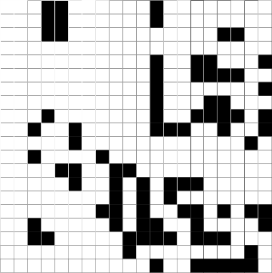

# SimpleLife

## Overview

If `A` is a zero-one (integer) matrix, then `life_step(A)` gives the next
generation from `A` in Conway's cellular automata Game of Life. The `run_life` function shows the progression of the cellular automata on the screen.

## Functions

#### `life_step`
Cellular automata are represented by an integer matrix with 1s representing
live cells and 0s dead cells. Given such a matrix `A`, the function
`life_step(A)` returns a new matrix that is the one-step progression
of the cellular automata. Optionally, `life_step(A,true)` signals that
the matrix wraps around (left and right edges are identified,
as are top and bottom edges) and so the domain is a torus.

#### `random_life`

The function `A = random_life(n,m)` creates a random `n`-by-`m` zero-one
matrix as a starting point for the cellular automata. A call to
`run_life(n)` is equivalent to `run_life(n,n)`.

#### `run_life`

The `run_life(A)` function is used to run and visualize the cellular
automata. The run goes on endlessly, but will stop if two consecutive
generations are identical. This function takes two named arguments:

* `pause=0.25` is the number of seconds between iterations. Note: The
first image may take a while to appear as the plotting software
initializes.
* `wrap=false` determines if the cellular automata field wraps. If `true`
then the domain is a torus.

Images look something like this:

