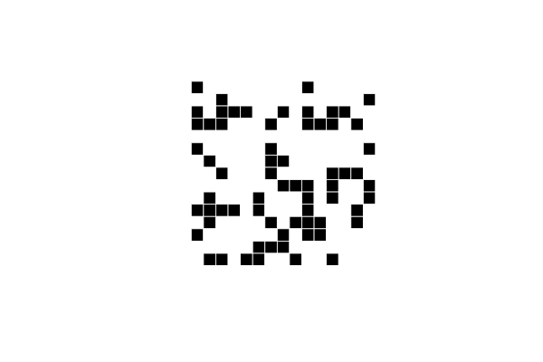

# SimpleLife

## Overview

If `A` is a zero-one (integer) matrix, then `life_step(A)` gives the next
generation from `A` in Conway's cellular automata Game of Life.
The `life_run` function shows the progression of the cellular
automata on the screen.

## Functions

###  `life_step`
Cellular automata are represented by an integer matrix with `1`s representing
live cells and `0`s dead cells. Given such a matrix `A`, the function
`life_step(A)` returns a new matrix that is the one-step progression
of the cellular automata. Optionally, `life_step(A,true)` signals that
the matrix wraps around (left and right edges are identified,
as are top and bottom edges) and so the domain is a torus.

We also provide `life_step!(A,wrap=false)` which overwrites `A` with the next
generation. `life_step!` returns `true` if the new `A` is different from
the old `A` and `false` if there was no change.

### `random_life`

The function `A = random_life(n,m)` creates a random `n`-by-`m` zero-one
matrix as a starting point for the cellular automata.

`random_life(n,m,p)` creates an `n`-by-`m` random matrix in which the
the probability a cell is a one is `p`.
* `random_life(n)` is equivalent to `random_life(n,n)`.
* `random_life(n,p)` is equivalent to `random_life(n,n,p)`.

### `life_run`

The `life_run(A)` function is used to run and visualize the cellular
automata. The run goes on endlessly, but will stop if there are no
live cells, if two consecutive
generations are identical, or if it enters a period-2 oscillation.
If `life_run` halts, it returns the number of iterations.

This function takes the following optional named arguments:

* `pause=0.0` is the number of extra seconds between iterations. Note: The
first image may take a while to appear as the plotting software
initializes.
* `wrap=false` determines if the cellular automata field wraps. If `true`
then the domain is a torus.
* `counter=false` shows the iteration number under the image.
* `max_steps` places a limit on the number of steps to run.

###  `life_movie`

`life_movie(A)` creates an animated GIF file. Use the following named
arguments to control:
* `file_name="life.gif"`: name of the GIF file in which to save
* `wrap::Bool=false`: edge wrapping (same as `life_run`)
* `max_steps:`: limit on the number of steps (frames)
* `rate = 5`: animation frames per second

#### Example

## Issues

The `life_step` function is reasonably fast, but `life_run` is slow for large
boards because of the visualization.
